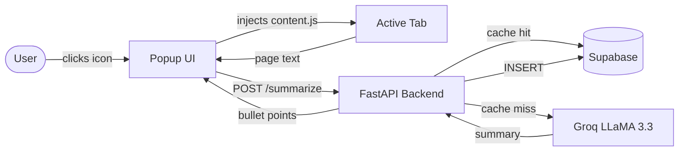

# SkipTheTerms


A Chrome Extension + FastAPI backend that reads any Terms of Service page and returns 5–7 brutally honest bullet points in seconds. Summaries are cached in Supabase so repeat visits are instant.

## How It Works



## Stack

| Layer | Technology |
|---|---|
| Extension | Vanilla JS · HTML/CSS · Chrome Manifest V3 |
| Backend | Python 3.8+ · FastAPI · Uvicorn · Pydantic |
| LLM | Groq API (`llama-3.3-70b-versatile`) |
| Database | Supabase (PostgreSQL) |
| Testing | pytest · httpx |

## Getting Started

### Prerequisites

- Python 3.8+
- Google Chrome
- [Supabase](https://supabase.com) project
- [Groq](https://console.groq.com) API key

### Backend

```bash
# 1. Clone and enter the repo
git clone https://github.com/rrubayet321/SkipTheTerms.git
cd SkipTheTerms

# 2. Create a virtual environment
python3 -m venv venv && source venv/bin/activate

# 3. Install dependencies
cd backend && pip install -r requirements.txt

# 4. Set environment variables
cp .env.example .env   # then fill in your credentials
```

`.env` requires three values:

```env
SUPABASE_URL=https://your-project-ref.supabase.co
SUPABASE_KEY=your-supabase-anon-key
GROQ_API_KEY=your-groq-api-key
```

```bash
# 5. Create the database table (run in the Supabase SQL editor)
CREATE TABLE termscache (
    id          BIGINT GENERATED ALWAYS AS IDENTITY PRIMARY KEY,
    url         TEXT UNIQUE NOT NULL,
    summary     TEXT NOT NULL,
    thumbs_up   INTEGER DEFAULT 0,
    thumbs_down INTEGER DEFAULT 0
);

# 6. Start the server
uvicorn main:app --reload
# API → http://localhost:8000
# Docs → http://localhost:8000/docs
```

### Extension

1. Go to `chrome://extensions` and enable **Developer mode**.
2. Click **Load unpacked** → select the `extension/` directory.
3. Pin the extension and navigate to any Terms of Service page.

## API Reference

| Method | Endpoint | Description |
|---|---|---|
| `GET` | `/` | Health check |
| `POST` | `/summarize` | Generate or retrieve a cached summary |
| `POST` | `/rate` | Submit a thumbs-up or thumbs-down vote |

**POST /summarize**

```json
// Request
{ "url": "https://example.com/terms", "text": "..." }

// Response
{ "url": "...", "summary": "• Point one\n• Point two", "cached": false }
```

`text` must be non-empty and under 50,000 characters.

**POST /rate**

```json
// Request
{ "url": "https://example.com/terms", "vote": "up" }

// Response
{ "url": "...", "thumbs_up": 15, "thumbs_down": 2 }
```

`vote` must be `"up"` or `"down"`. Returns `404` if the URL has no cached entry.

## Tests

No live credentials needed — all external calls are mocked.

```bash
cd backend
pytest test_main.py -v   # 8 tests, ~0.2s
```

## Known Limitations

- **Text truncation** — Only the first 4,000 characters of scraped text are sent to the LLM.
- **Vote race condition** — The `/rate` endpoint uses read-then-write; high concurrency could cause lost increments.
- **Localhost only** — The extension points to `http://localhost:8000`. Update `BACKEND_URL` in `popup.js` for remote deployments.
- **Unpinned dependencies** — Pin versions in `requirements.txt` for reproducible production builds.

## License

[MIT](LICENSE)
