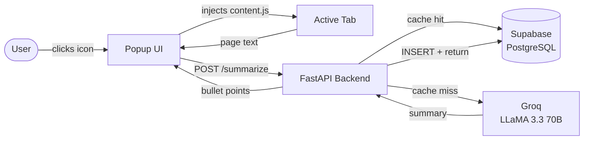

# SkipTheTerms


> You have clicked *"I Agree"* thousands of times. You have read zero of those documents.

**SkipTheTerms** is a Chrome Extension that reads Terms of Service pages so you don't have to. Click the extension icon on any ToS page and get 5–7 plain-English bullet points — brutally honest, zero legalese — in under 3 seconds.

Built as a full-stack personal project to explore LLM integration, browser extension development, and API design.

---

## Demo

```
User opens "Terms of Service" page on any website
           ↓
  Clicks the SkipTheTerms extension icon
           ↓
  Extension scrapes the page text and sends it to the FastAPI backend
           ↓
  Backend checks Supabase cache → cache hit? Return instantly.
                                → cache miss? Call Groq LLaMA 3.3 70B.
           ↓
  5–7 sarcastic bullet points animate into the popup UI
```

**Example output for a typical ToS:**
- • They can terminate your account at any time, for any reason
- • Your content belongs to them once uploaded
- • They share your data with "trusted partners" (everyone)
- • You waive your right to a class action lawsuit
- • Prices can change without notice

---

## Architecture



---

## Tech Stack

| Layer | Technology | Why |
|---|---|---|
| Extension | Vanilla JS · Chrome Manifest V3 | Lightweight, no build step needed |
| Backend | Python · FastAPI · Pydantic | Fast async API with automatic validation and docs |
| LLM | Groq API (`llama-3.3-70b-versatile`) | Sub-second inference, OpenAI-compatible SDK |
| Database | Supabase (PostgreSQL) | Managed Postgres with a clean Python client |
| Testing | pytest · httpx | Zero-credential unit tests via dependency mocking |

---

## Technical Highlights

A few design decisions worth calling out:

**Cost-aware caching** — Every summary is stored in Supabase keyed by URL. A cache hit costs $0 and returns in ~50ms. A cache miss calls Groq, which costs fractions of a cent. This keeps the project free to run at low volume.

**Prompt engineering** — The system prompt instructs the model to act as a "sarcastic lawyer" and enforces a strict format: 5–7 bullet points, each starting with `•`, max 10 words per bullet. Consistent output format is what makes the client-side parsing reliable.

**Fast-fail startup validation** — All three required env vars (`SUPABASE_URL`, `SUPABASE_KEY`, `GROQ_API_KEY`) are validated at import time. The server refuses to start rather than failing cryptically mid-request.

**CORS security** — `allow_origins=["*"]` with `allow_credentials=True` is a browser-rejected combination per the CORS spec. The extension uses credentialless `fetch()`, so `allow_credentials` is correctly set to `False`.

**XSS protection** — API responses are HTML-escaped before being injected into the popup DOM, preventing a malicious ToS from executing scripts in the extension context.

**Input length guard** — The API rejects payloads over 50,000 characters before they hit the database or LLM, protecting both memory and API costs.

---

## Getting Started

### Prerequisites

- Python 3.8+, Google Chrome
- [Supabase](https://supabase.com) project (free tier)
- [Groq](https://console.groq.com) API key (free tier)

### Backend

```bash
git clone https://github.com/rrubayet321/SkipTheTerms.git
cd SkipTheTerms

python3 -m venv venv && source venv/bin/activate
cd backend && pip install -r requirements.txt

cp ../.env.example ../.env   # fill in your three credentials
uvicorn main:app --reload    # → http://localhost:8000
```

Create the Supabase table before starting:

```sql
CREATE TABLE termscache (
    id          BIGINT GENERATED ALWAYS AS IDENTITY PRIMARY KEY,
    url         TEXT UNIQUE NOT NULL,
    summary     TEXT NOT NULL,
    thumbs_up   INTEGER DEFAULT 0,
    thumbs_down INTEGER DEFAULT 0
);
```

### Extension

1. Go to `chrome://extensions` → enable **Developer mode**
2. Click **Load unpacked** → select the `extension/` folder
3. Pin it and navigate to any Terms of Service page

---

## API Reference

| Method | Endpoint | Description |
|---|---|---|
| `GET` | `/` | Health check |
| `POST` | `/summarize` | Generate or retrieve a cached summary |
| `POST` | `/rate` | Submit a thumbs-up or thumbs-down vote |

**POST /summarize** — `text` must be non-empty and under 50,000 characters.

```json
// Request
{ "url": "https://example.com/terms", "text": "..." }

// Response
{ "url": "...", "summary": "• Point one\n• Point two", "cached": false }
```

**POST /rate** — `vote` must be `"up"` or `"down"`. Returns `404` if the URL has no cached entry.

```json
// Request  
{ "url": "https://example.com/terms", "vote": "up" }

// Response
{ "url": "...", "thumbs_up": 15, "thumbs_down": 2 }
```

---

## Tests

The test suite mocks all external dependencies — no live credentials required.

```bash
cd backend && pytest test_main.py -v   # 8 tests, ~0.2s
```

Covers: health check, input validation (empty URL, empty text, oversized payload), cache hit path, cache miss + LLM call, invalid vote, and 404 on unrecognized URL.

---

## Known Limitations

- Only the first 4,000 characters of page text reach the LLM — clauses buried deep in long documents may be missed.
- The `/rate` endpoint uses read-then-write; high concurrency could cause lost vote increments (no atomic DB update).
- Backend is hardcoded to `localhost:8000`. Update `BACKEND_URL` in `popup.js` for remote deployments.

---

## License

[MIT](LICENSE)
