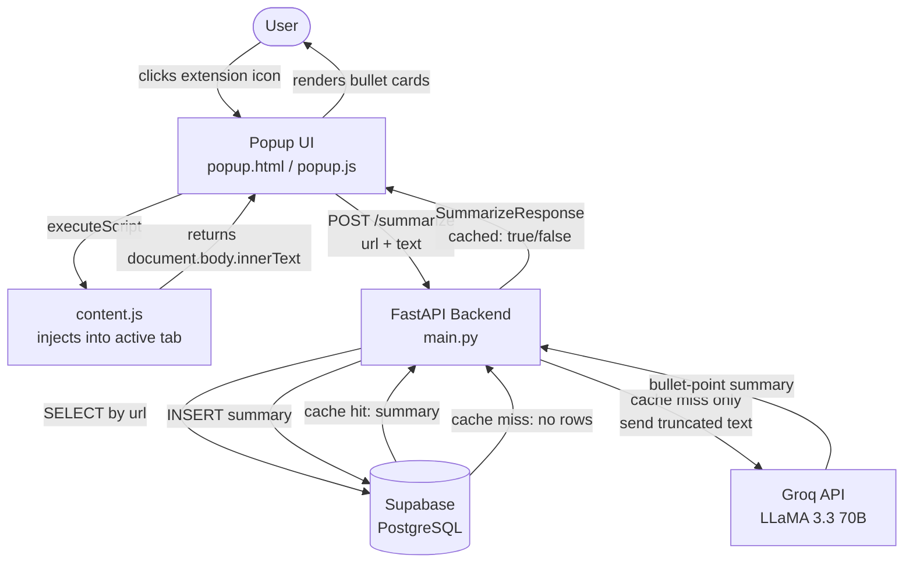

# SkipTheTerms


> **You agreed to let them sell your data. You didn't have to — you just didn't read the 47-page Terms of Service.**

SkipTheTerms is a Chrome Extension backed by a FastAPI service that distills any Terms of Service page into 5–7 brutally honest bullet points in seconds, powered by Groq's LLaMA 3.3 70B model. Summaries are cached in Supabase so repeat visits are instant and free.

---

## Table of Contents

- [Features](#features)
- [Architecture](#architecture)
- [Tech Stack](#tech-stack)
- [Getting Started](#getting-started)
  - [Prerequisites](#prerequisites)
  - [Backend Setup](#backend-setup)
  - [Extension Setup](#extension-setup)
- [API Reference](#api-reference)
- [Database Schema](#database-schema)
- [Running the Tests](#running-the-tests)
- [Known Limitations](#known-limitations)
- [Contributing](#contributing)
- [License](#license)

---

## Features

| Feature | Description |
|---|---|
| **Instant Summaries** | Extracts legal text from the active tab and returns plain-English bullet points in under 3 seconds. |
| **Intelligent Caching** | Summaries are stored by URL in Supabase; identical URLs are served from cache at zero LLM cost. |
| **Sarcastic Tone** | Powered by a "sarcastic lawyer" system prompt — informative and actually enjoyable to read. |
| **User Ratings** | Thumbs-up / thumbs-down feedback loop tied to each cached summary. |
| **XSS-Safe Rendering** | All API output is HTML-escaped before being injected into the popup DOM. |
| **Graceful Error Handling** | Timeout protection, user-friendly error banners, and non-fatal cache-write failures. |

---

## Architecture



---

## Tech Stack

| Layer | Technology |
|---|---|
| Browser Extension | Vanilla JS, HTML/CSS, Chrome Extension APIs (Manifest V3) |
| Backend | Python 3.8+, FastAPI, Uvicorn, Pydantic |
| LLM | Groq API — `llama-3.3-70b-versatile` (via OpenAI-compatible SDK) |
| Database | Supabase (PostgreSQL), `supabase-py` client |
| Testing | pytest, httpx |
| Config | `python-dotenv` |

---

## Getting Started

### Prerequisites

- Python 3.8 or higher
- Google Chrome or any Chromium-based browser
- A [Supabase](https://supabase.com) project (free tier is sufficient)
- A [Groq](https://console.groq.com) API key (free tier is sufficient)

### Backend Setup

1. **Clone the repository:**
   ```bash
   git clone https://github.com/your-username/SkipTheTerms.git
   cd SkipTheTerms
   ```

2. **Create and activate a virtual environment:**
   ```bash
   python3 -m venv venv
   source venv/bin/activate       # macOS / Linux
   venv\Scripts\activate          # Windows
   ```

3. **Install dependencies:**
   ```bash
   cd backend
   pip install -r requirements.txt
   ```

4. **Configure environment variables:**

   Copy the provided template and fill in your credentials:
   ```bash
   cp .env.example .env
   ```
   ```env
   SUPABASE_URL=https://your-project-ref.supabase.co
   SUPABASE_KEY=your-supabase-anon-key
   GROQ_API_KEY=your-groq-api-key
   ```
   > The server will fail fast at startup if any of these three variables are missing.

5. **Create the database table** in the Supabase SQL Editor:
   ```sql
   CREATE TABLE termscache (
       id          BIGINT GENERATED ALWAYS AS IDENTITY PRIMARY KEY,
       url         TEXT UNIQUE NOT NULL,
       summary     TEXT NOT NULL,
       thumbs_up   INTEGER DEFAULT 0,
       thumbs_down INTEGER DEFAULT 0
   );
   ```

6. **Start the server:**
   ```bash
   uvicorn main:app --reload
   ```
   The API will be available at `http://localhost:8000`.
   Interactive Swagger docs are at `http://localhost:8000/docs`.

### Extension Setup

1. Open Chrome and go to `chrome://extensions`.
2. Enable **Developer mode** (toggle in the top-right corner).
3. Click **Load unpacked** and select the `extension/` directory from this repository.
4. Pin the extension to your toolbar for easy access.
5. Navigate to any Terms of Service page and click the extension icon.

---

## API Reference

### `GET /`

Health check. Returns `200 OK` when the server is running.

**Response:**
```json
{
  "status": "ok",
  "message": "SkipTheTerms backend is running."
}
```

---

### `POST /summarize`

Generates (or retrieves from cache) a bullet-point summary for the given URL.

**Request body:**
```json
{
  "url": "https://example.com/terms",
  "text": "The full terms of service text extracted from the page..."
}
```

| Field | Type | Constraints |
|---|---|---|
| `url` | string | Required, non-empty |
| `text` | string | Required, non-empty, max 50,000 characters |

**Response:**
```json
{
  "url": "https://example.com/terms",
  "summary": "• They can delete your account at any time\n• Your data is sold to third parties\n• You waive your right to a jury trial",
  "cached": false
}
```

**Error responses:**

| Status | Condition |
|---|---|
| `400` | Empty URL, empty text, or text exceeding 50,000 characters |
| `502` | Groq API call failed |
| `500` | Supabase read/write error |

---

### `POST /rate`

Records a thumbs-up or thumbs-down vote for a previously summarized URL.

**Request body:**
```json
{
  "url": "https://example.com/terms",
  "vote": "up"
}
```

| Field | Type | Constraints |
|---|---|---|
| `url` | string | Required, must have an existing cached entry |
| `vote` | string | Must be `"up"` or `"down"` |

**Response:**
```json
{
  "url": "https://example.com/terms",
  "thumbs_up": 15,
  "thumbs_down": 2
}
```

**Error responses:**

| Status | Condition |
|---|---|
| `400` | Invalid vote value |
| `404` | No cached entry found for the given URL |
| `500` | Supabase read/write error |

---

## Database Schema

```sql
CREATE TABLE termscache (
    id          BIGINT GENERATED ALWAYS AS IDENTITY PRIMARY KEY,
    url         TEXT UNIQUE NOT NULL,
    summary     TEXT NOT NULL,
    thumbs_up   INTEGER DEFAULT 0,
    thumbs_down INTEGER DEFAULT 0
);
```

---

## Running the Tests

The test suite uses `pytest` with a mocked Supabase client and Groq service — no live credentials are required.

```bash
cd backend
pytest test_main.py -v
```

Expected output:
```
collected 8 items

test_main.py::test_health_check                        PASSED
test_main.py::test_summarize_rejects_empty_url         PASSED
test_main.py::test_summarize_rejects_empty_text        PASSED
test_main.py::test_summarize_rejects_oversized_text    PASSED
test_main.py::test_summarize_returns_cached_result     PASSED
test_main.py::test_summarize_calls_llm_on_cache_miss   PASSED
test_main.py::test_rate_rejects_invalid_vote           PASSED
test_main.py::test_rate_returns_404_for_uncached_url   PASSED

8 passed in 0.20s
```

---

## Known Limitations

- **Text truncation:** The extension scrapes the full page body, but only the first 4,000 characters are sent to the LLM. On very long ToS documents, clauses near the end of the document may not be reflected in the summary.
- **Vote race condition:** The `/rate` endpoint uses a read-then-write pattern. Under high concurrent load, simultaneous votes for the same URL could result in lost increments. A future fix would move the increment to a Postgres atomic `UPDATE ... SET thumbs_up = thumbs_up + 1`.
- **Unpinned dependencies:** `requirements.txt` specifies no version bounds. For production deployments, pin all packages to ensure reproducible builds.
- **Localhost-only backend:** The extension is hardcoded to `http://localhost:8000`. To deploy the backend remotely, update `BACKEND_URL` in `extension/popup.js` and adjust the `host_permissions` in `extension/manifest.json`.

---

## Contributing

Contributions are welcome. Please open an issue to discuss the change before submitting a pull request.

1. Fork the repository.
2. Create a feature branch: `git checkout -b feature/your-feature-name`
3. Commit your changes with a clear message.
4. Open a pull request against `main`.

---

## License

This project is licensed under the [MIT License](LICENSE).
